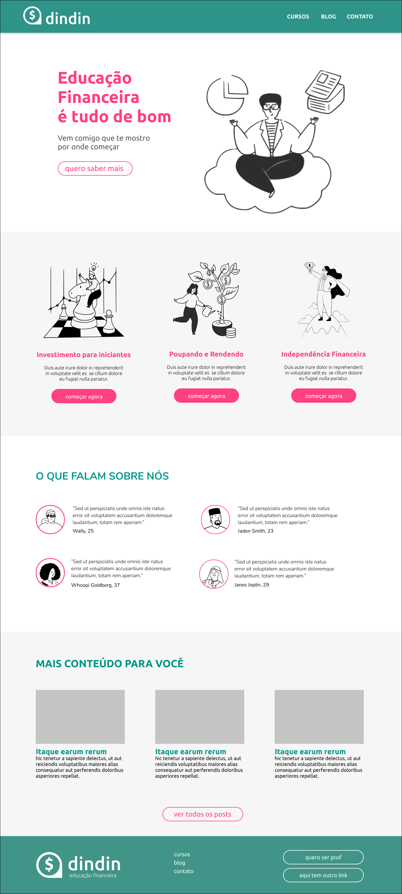
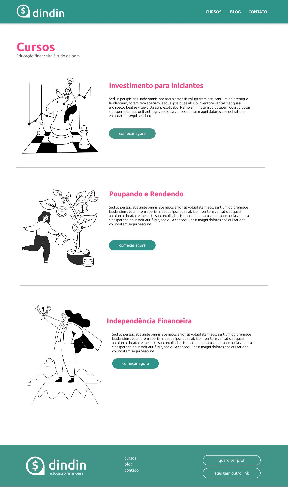
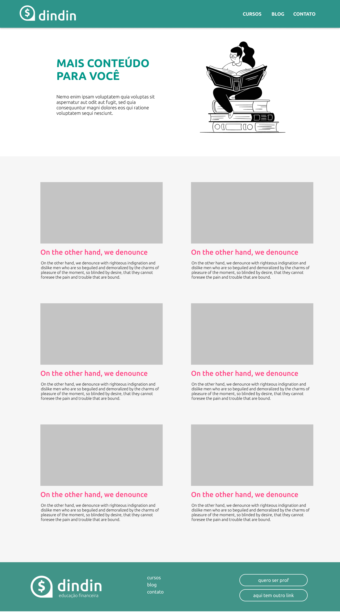

<h1 align="center"> Projeto Institucional - Gama Academy - Desafio 1 </h1>

 

  <a href="#-sobre">Sobre</a>&nbsp;&nbsp;&nbsp;|&nbsp;&nbsp;&nbsp;
  <a href="#-projeto">Projeto</a>&nbsp;&nbsp;&nbsp;|&nbsp;&nbsp;&nbsp;
  <a href="#-tecnologias">Tecnologias</a>&nbsp;&nbsp;|&nbsp;&nbsp;&nbsp;&nbsp;
  <a href="#-Serviços">Serviços</a>&nbsp;&nbsp;&nbsp;|&nbsp;&nbsp;&nbsp;
  <a href="#-Autores">Autores</a>&nbsp;&nbsp;&nbsp;&nbsp;&nbsp;&nbsp;

 

## 🎯 Sobre

Esse prejeto foi proposto pela Gama Academy em formato de desafio, o objetivo do desafio é praticar todas as competências adquiridas ao longo do primeiro mês

 

## 📷 Projeto
 

A empresa fictícia DINDIN, desejava uma plataforma de conteúdo sobre Educaçõa Financeira

 

## 🚀 Tecnologias

Esse projeto foi desenvolvido com as seguintes tecnologias:

- HTML e CSS
- Git e GitHub

 

## 📍 site

- aqui voce poderá ver o site completo: .... 
 

## 🛠️ Serviços

- <a href="https://github.com/Matheus-Ellenberger">GitHub</a> - Hospedagem
- <a href="https://fonts.google.com/">Google Fonts</a> - Fontes

 

## 🙋‍♂️ 🙋‍♂️ 🙋‍♂️ Autores

- Feito por Matheus Ellenberger <a href="https://github.com/Matheus-Ellenberger">GitHub</a>

- Feito por Neylor Felipe <a href="https://github.com/neylorfelipet3">GitHub</a>

- Feito por Renan Bascheschi <a href="https://github.com/renanbacheschi">GitHub</a>
